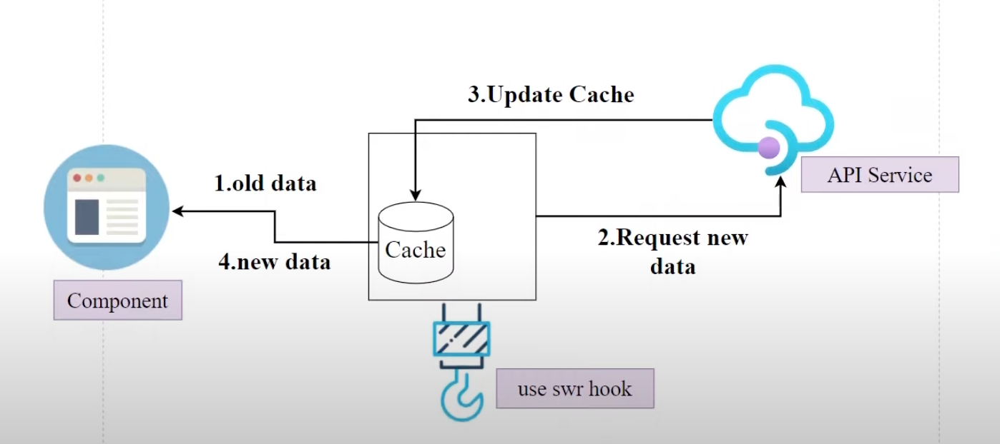

# Next, SWR, TypeScript Project

```
SWR
|_ Stale / Not Fresh
|_ While
|_ Revalidate
```



### Setup

Setup nextjs and run the development server:

```bash
npx create-next-app next-swr-app --typescript
cd next-swr-app # navigate into the project directory
npm run dev
# or
yarn dev
```

### useSWR

- TypeScript-friendly
- SWR will also infer the argument types of `fetcher` from `key`

```bash
yarn add swr # install swr
import useSWR from 'swr'
const { data } = useSWR('https://www.some-link.com', (apiURL: string) => fetch(apiURL).then(res => res.json())
```

A `Key`: a string that serves as the unique identifier for the data we are fetching. This is usually the API URL we are calling.
A `fetcher`: a function that returns the fetched data.

### Material Design

```bash
yarn add materialize-css
yarn add -D @types/materialize-css
```

In App.tsx

```bash
import "materialize-css/dist/css/materialize.min.css"
useEffect(() => {
  const M = require("materialize-css")
  M.AutoInit()
}, [])
```

### Form Validator

With `react-hook-form yup`

```bash
yarn add react-hook-form yup @hookform/resolvers
```
